# Chapter 4: Flow Diagrams

This chapter contains Mermaid sequence diagrams illustrating the end-to-end communication flows between the unofficial API client, the browser, and the PGBank API Gateway.

---

## 1. Handshake & Bootstrapping

This initial phase fetches system properties and sets up the default credentials necessary to communicate with the API.

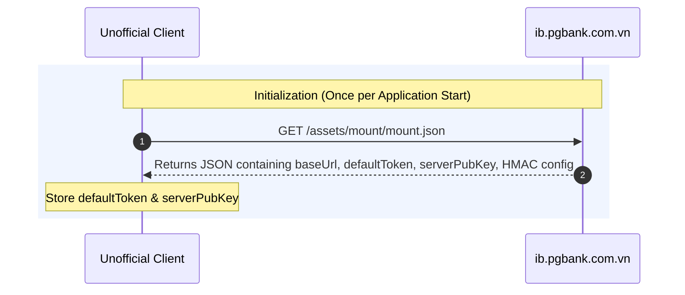

---

## 2. Authentication Flow (New Device / Requires OTP)

If the client is authenticating from a new `browserId` or if session state is missing, the server challenges the client with a 2-step OTP flow.

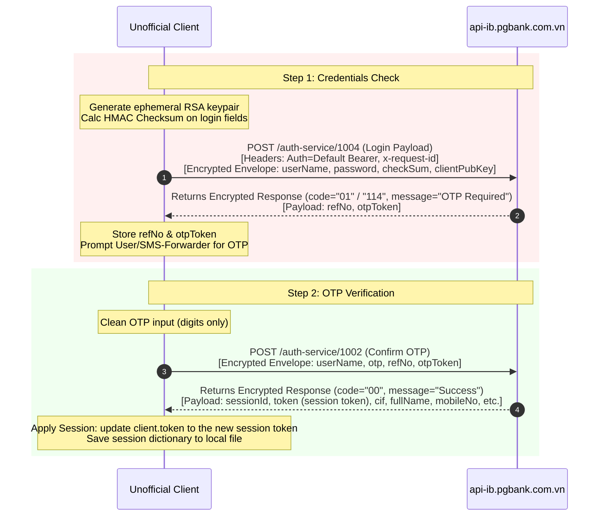

---

## 3. Session Restoration (Bypassing OTP)

If a session is restored using a valid, non-expired session token and a trusted `browserId`, the client can skip Step 1 & 2.

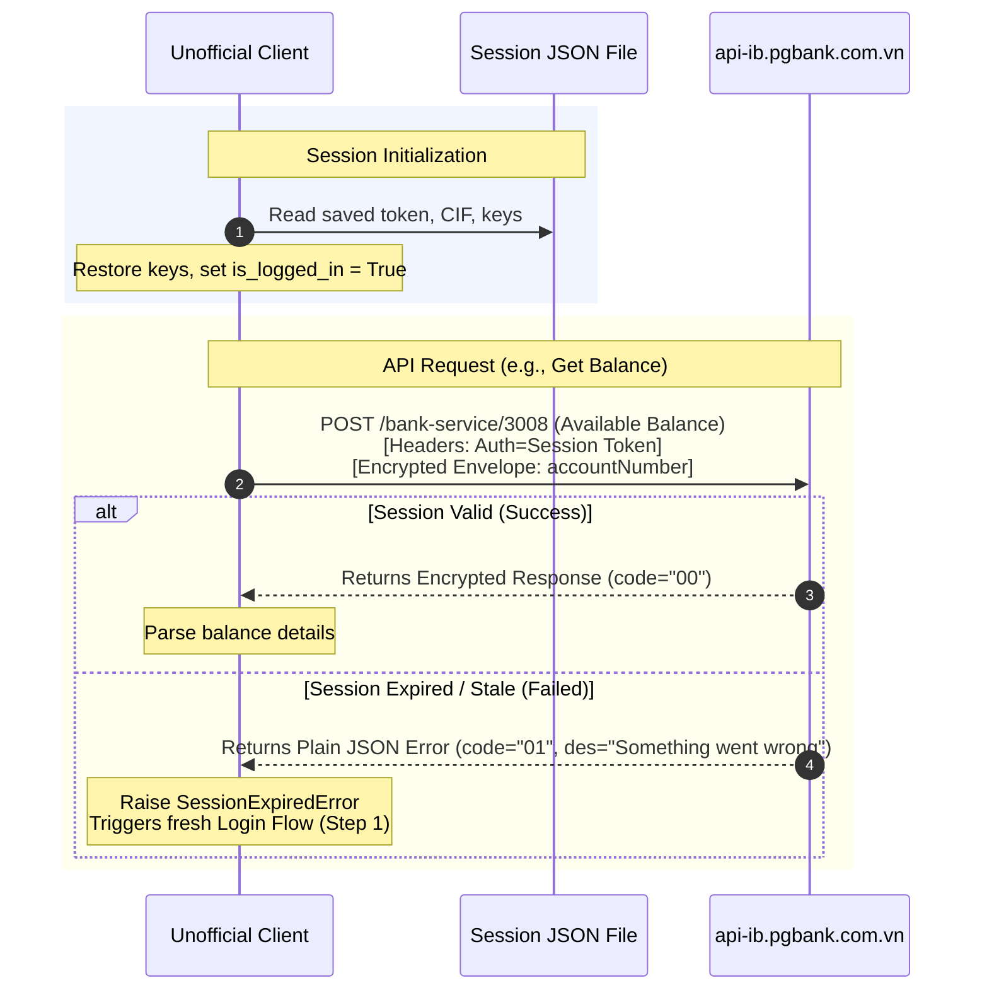

---

## 4. Query Flow (Balance & Profile)

Once the session token is set in the `Authorization` header, the client can query account details:

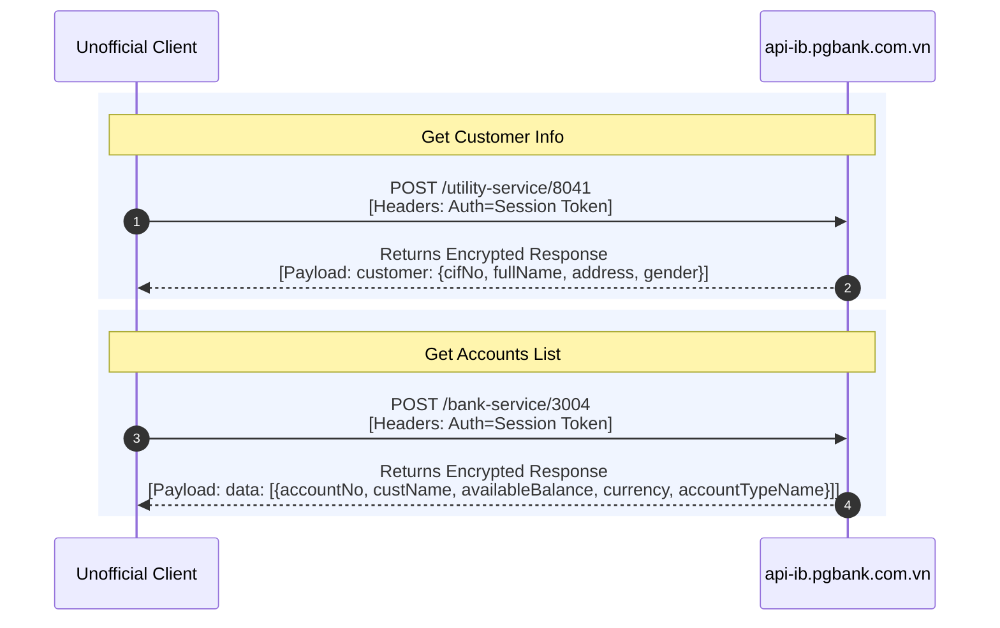

---

## 5. Recipient Name Verification Flow

This flow resolves the recipient's full name given a target bank code and account/card number.

### A. Internal / CITAD Transfer (MID 5000)
Used when sending to another PGBank account or via standard interbank CITAD:
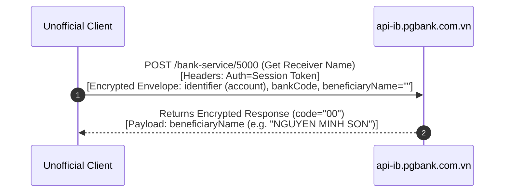

### B. NAPAS 24/7 Fast Transfer (MID 5009)
Used when resolving names for interbank 24/7 fast transfers by card or account number:
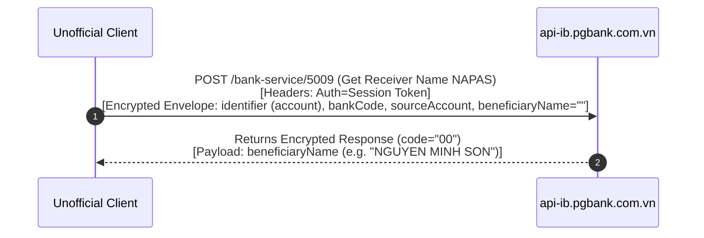

---

## 6. Password Change Flow (No OTP)

PGBank allows logged-in users to change their password using the old password, new password, and confirmation password, without sending an SMS OTP.

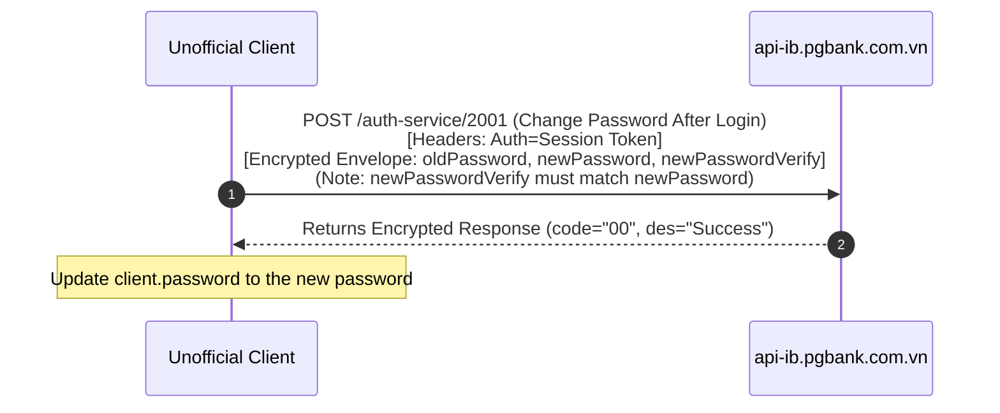

---

## 7. Contact (Beneficiary) Management Flow

PGBank supports full CRUD operations on saved transfer contacts (beneficiaries).

### A. Fetch Contacts List (MID 8014)
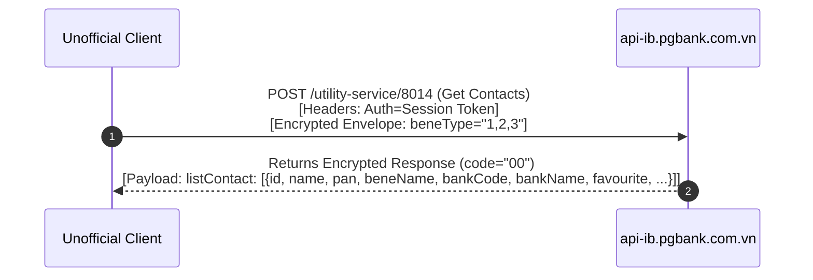

### B. Create Contact (MID 8015)
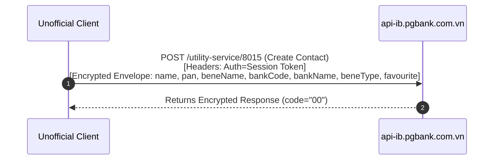

### C. Update Contact (MID 8016)
Used to toggle favorite status or update the contact's nickname:
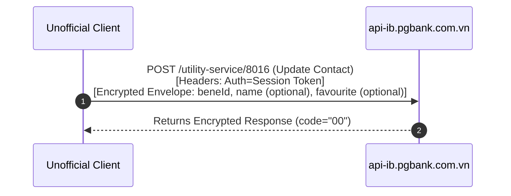

### D. Delete Contacts (MID 8017)
Supports single or bulk deletion via comma-separated ID lists:
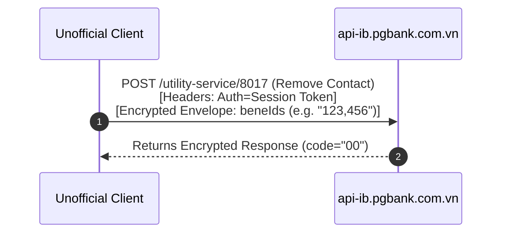

In the next chapter, we will go over educational notes, architectural patterns, and troubleshooting tips for maintaining unofficial client wrappers.
